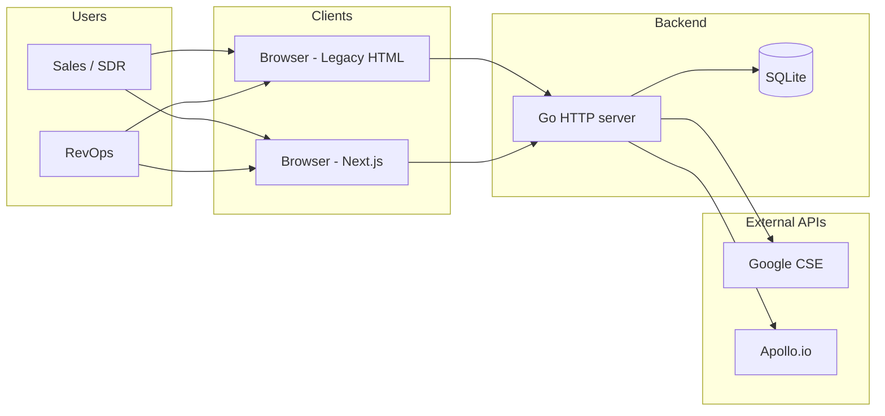
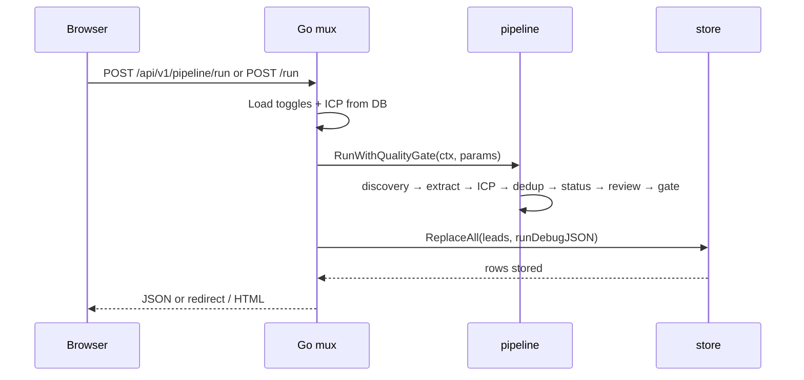

# Sales Radar — System Architecture

**Version:** April 2026 · **Style:** C4-lite (context + containers + key components)

---

## 1. System context

- **Workhub / bawana.xyz** is **out of scope** for this repo; Sales Radar is a **standalone** product with planned hostnames **`sales.bawana.xyz`** (UI) and **`api.sales.bawana.xyz`** (API).

---

## 2. Repository layout (high level)

| Path | Purpose |
|------|---------|
| `cmd/web` | Monolith: **embedded** `templates/*.html`, `static/`, HTTP routes, **`api.Register`** for `/api/v1/*`. |
| `cmd/api` | **API-only** entrypoint; `api.Register` only; optional CORS wrapper. |
| `cmd/salesradar` | CLI: runs pipeline, prints JSON/CSV/CRM shapes (no web DB replace in default flow). |
| `internal/api` | JSON handlers, DTOs, `request` (list filter), `exportcsv`, `debugview`, `jsonerr`. |
| `internal/pipeline` | `RunWithQualityGate`, `RunStats`, orchestration. |
| `internal/discovery` | Discovery modes, `ProviderStatus`, candidates. |
| `internal/store` | SQLite, migrations, `Lead`, `ReplaceAll`, settings KV, pipeline run rows. |
| `internal/icp` | Scoring, catalogs, runtime settings from form. |
| `internal/review` | Review leads, actions, copy. |
| `internal/*` | Dedup, extraction, enrichment, quality, status, Apollo, Google CSE, etc. |
| `frontend/` | Next.js 15 App Router + Tailwind; talks to Go via **HTTPS JSON**. |
| `db/migrations` | SQL migrations applied by `store.Open`. |

---

## 3. Request flow (Generate Leads)

---

## 4. Frontend (Next.js) architecture

| Piece | Responsibility |
|-------|------------------|
| `app/layout.tsx` | Root layout, **AppShell** (sidebar). |
| `app/leads/page.tsx` | Server Component: `fetch` API with `searchParams` → table + filters + KPI. |
| `lib/api-client.ts` | Base URL from `NEXT_PUBLIC_API_BASE_URL`; `apiJson`, `ApiError`. |
| `lib/lead-display.ts` | Readiness / priority / source / signal helpers (parity with HTML templates). |
| `lib/pipeline-url.ts` | Merge POST run stats into `/leads` query string (KPI echo). |
| `components/leads/*` | Filters form, KPI strip, table, generate, export buttons. |

**Important:** `frontend/next.config.ts` sets **`turbopack.root`** and **`outputFileTracingRoot`** to the `frontend/` directory so Next does **not** infer a parent monorepo root when multiple lockfiles exist (avoids **404** on `/leads`).

---

## 5. Data flow (read path)

- **List/detail/export** read from denormalized **`leads`** (and helper queries `DistinctIndustries`, `Count`, `LatestPipelineRun`).
- Deeper normalized **discovery engine** tables exist for pipeline internals; see `docs/discovery_engine_schema.md`. UI acceptance is defined against **`store.List` / `store.Get`** outputs.

---

## 6. Deployment topology (target)

| Component | Suggested host | Notes |
|-----------|----------------|-------|
| Next frontend | **Vercel** (`sales.bawana.xyz`) | Env: `NEXT_PUBLIC_API_BASE_URL=https://api.sales.bawana.xyz` |
| Go API | **Fly.io / Railway / Render / Cloud Run**, etc. | Bind `:8080` or platform port; **persistent volume** for SQLite **or** future Postgres |
| Legacy HTML | Same process as API if using `cmd/web` | Single binary for intranet |

**CORS:** Browser calls from Vercel origin require **`cmd/api -cors https://sales.bawana.xyz`** (or equivalent middleware).

---

## 7. Failure isolation

- Pipeline errors return **500** + JSON error body from API routes.
- Integration missing keys: discovery/enrichment **skips** or uses mock per env (`SALESRADAR_USE_MOCK_DISCOVERY`, etc.) — see `internal/discovery`.

---

*Last updated April 2026.*
